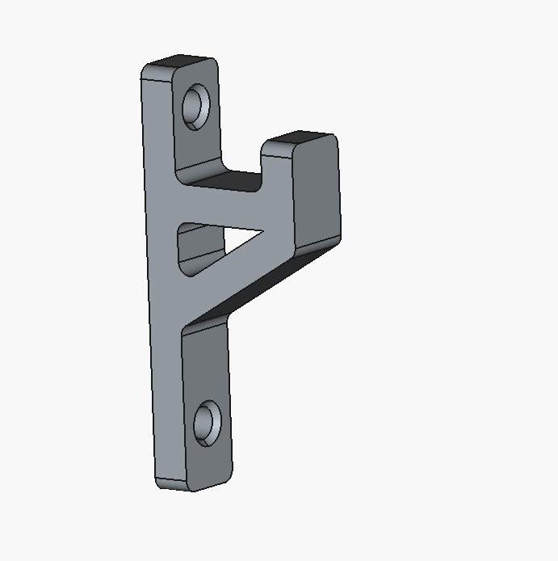
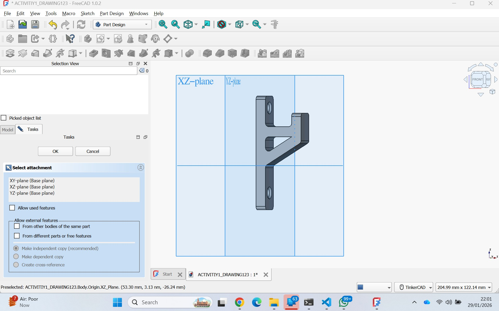
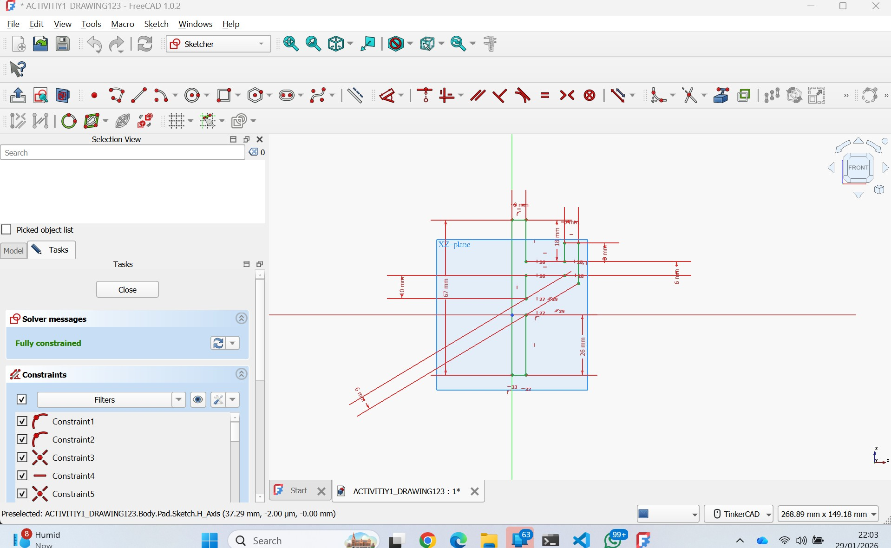
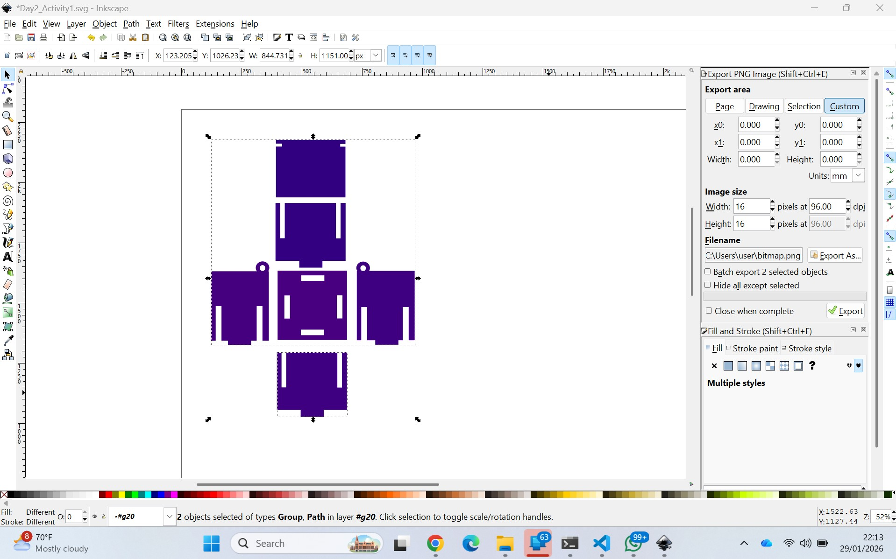

# 2. Activity of Day 2

# Activity 1 – FreeCAD Model  
## L-Shaped Mounting Bracket (3D)

### Objective
The objective of this activity is to model a **simple L-shaped mounting bracket** in **FreeCAD**, focusing on understanding basic solid modeling operations and design intent.

This exercise emphasizes **clarity, precision, and reproducibility**, rather than complex geometry.

---

## Understanding the Object from Reference Images

From the provided images, the following characteristics can be identified:

- The object is an **L-shaped solid part**
- It consists of **two flat faces positioned at 90°**
- There are **two round holes** designed for screws or bolts
- The geometry is **simple and functional**
- One external corner is **rounded using a fillet**
- All other edges remain **sharp and clean**

This makes the part ideal for learning **parametric modeling fundamentals**.

---

## Modeling Strategy in FreeCAD

To recreate the bracket accurately, the following FreeCAD workflow is used:

### 1. Sketch – Create the 2D Profile
- A **2D sketch** is created on the XY plane
- The sketch represents the **side profile** of the L-shape
- All lines are constrained using:
  - Horizontal and vertical constraints
  - Coincident constraints
  - Dimensional constraints (length, height, thickness)
- The sketch is fully constrained (no degrees of freedom)

> A fully constrained sketch ensures model stability and easy modification.

---

### 2. Pad – Create the 3D Volume
- The 2D sketch is **extruded using Pad**
- This operation creates the **3D solid bracket**
- The pad length defines the **depth of the bracket**
- Symmetric or one-direction padding can be used depending on design intent

---

### 3. Hole – Create Mounting Holes
- Two **round holes** are added on the flat faces
- The **Hole tool** is used instead of sketch-based cuts
- Hole parameters include:
  - Diameter (based on screw/bolt size)
  - Depth (through-all)
- Hole positions are constrained using references or dimensions

> Using the Hole tool improves parametric control and clarity.

---

### 4. Fillet – Round the Corner
- A **fillet** is applied to one external corner
- This improves:
  - Mechanical strength
  - Safety (removes sharp edge)
  - Professional appearance
- Only one corner is filleted to match the reference object

---

## Design Intent
The design prioritizes:
- **Simplicity** – no unnecessary features
- **Manufacturability** – easy to fabricate using common methods
- **Functionality** – strong 90° support with mounting holes
- **Parametric control** – dimensions can be easily modified

---

## Expected Outcome
At the end of this activity, the final model should:
- Accurately represent an L-shaped bracket
- Have two perpendicular faces at 90°
- Contain two correctly sized holes
- Include one filleted corner
- Be clean, simple, and fully parametric

This model serves as a foundation for future fabrication exercises such as **3D printing or CNC machining**.

--------------------------------------------------------------------------------------------------------------------------------

# Activity 2 – InkSpace

# Activity – 2D Vector Design  
## Slotted Rectangular Panel (Inkscape)

### Objective
The objective of this activity is to design a **2D slotted rectangular panel** using **Inkscape**, focusing on accurate vector geometry for **press-fit fabrication**.

This exercise emphasizes **precision, scale accuracy, and clean paths**, which are essential for laser cutting and CNC workflows.

---

## Understanding the Object from Reference Images

From the provided images, the following characteristics can be identified:

- The object is a **flat rectangular panel**
- **Rectangular slots** are cut into the edges
- The slot widths are **matched to the material thickness**
- The design is intended to **slide and lock with other panels**
- The entire design consists of **pure 2D vector geometry**
- No 3D features or curves are present

This type of geometry is ideal for **laser cutting** and **2D CNC machining**.

---

## Design Intent

The design is created to:
- Enable **press-fit assembly** without fasteners
- Ensure **tight but manufacturable joints**
- Allow multiple panels to interlock at right angles
- Be easily reproduced using 2D fabrication machines

---

## Vector Design Strategy in Inkscape

To recreate this design accurately, the following principles are applied:

### 1. 1:1 Scale (Real-World Dimensions)
- The document units are set to **millimeters**
- The design is drawn at **full scale (1:1)**
- All dimensions directly correspond to real material sizes

> Designing at 1:1 scale ensures the fabricated part matches the digital design exactly.

---

### 2. Clean Paths (Precise Vector Geometry)
- Shapes are created using **rectangles and straight lines**
- All paths are **closed and clean**
- No overlapping or duplicate lines are present
- Stroke width is set appropriately for visibility (not for cutting)

> Clean paths are critical to avoid errors during laser cutting.

---

### 3. Slot Accuracy (Press-Fit Design)
- Slot width is set equal to the **material thickness**
- A small tolerance may be applied depending on fabrication method
- Slot depth is consistent to ensure proper locking
- Slots are aligned symmetrically for balanced assembly

> Slot accuracy directly determines whether parts fit too loosely or too tightly.

---
## Fabrication Considerations
This design is intended for:
- **Laser cutting** (acrylic, plywood, MDF)
- **2D CNC routing**
- Flat-sheet materials with consistent thickness

Key considerations:
- Kerf (material removed by the laser)
- Material flexibility
- Sheet thickness variation

---

## Expected Outcome
At the end of this activity, the final vector design should:
- Be a flat rectangular panel with edge slots
- Be drawn entirely in 2D vector format
- Use correct real-world dimensions
- Allow press-fit assembly with matching panels
- Be ready for export as **SVG, DXF, or PDF**

This activity reinforces the importance of **precision and design-for-fabrication** in 2D workflows.

Figure: InkScape Design