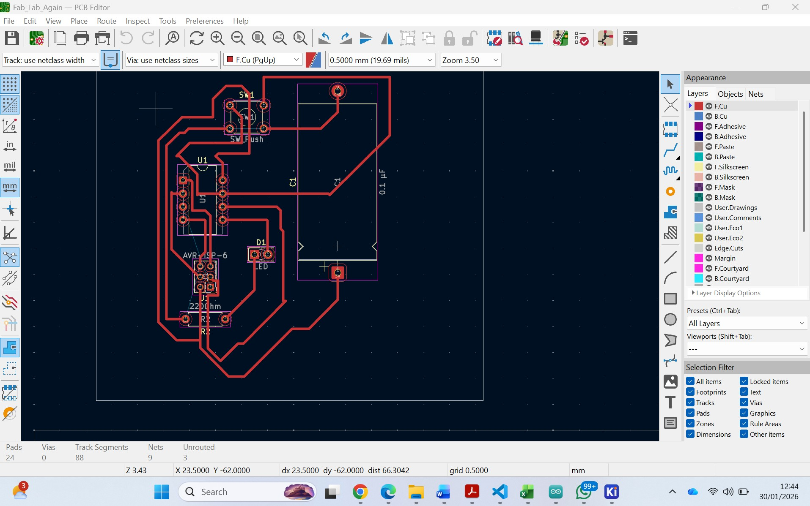
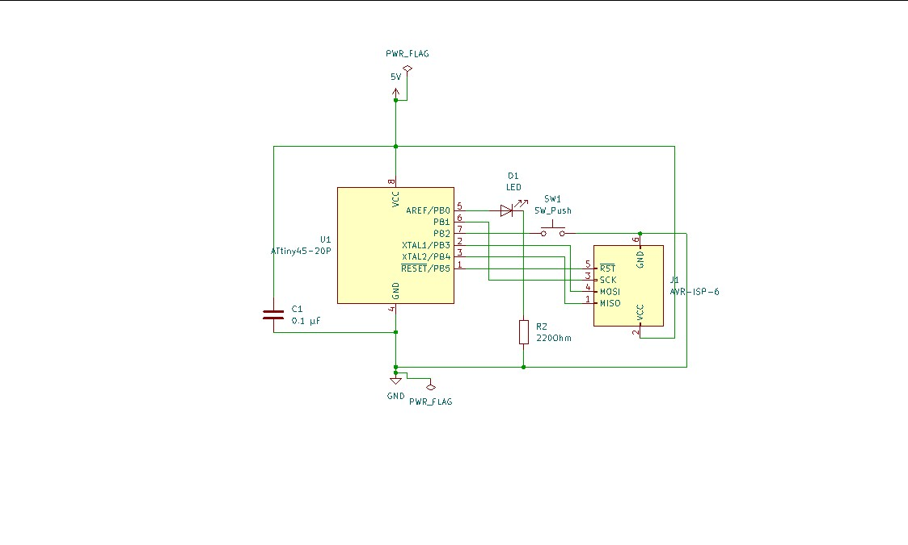
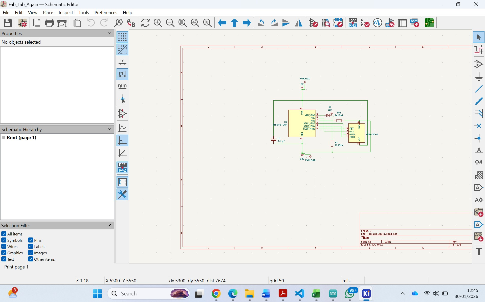
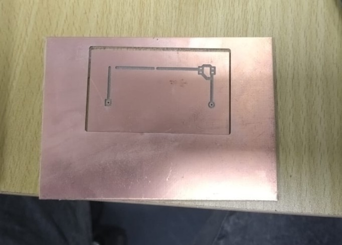
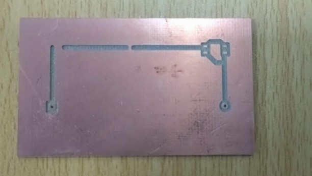

# 3. Activity of Day 3

# Single-Sided Microcontroller PCB Design (KiCad)

## ATtiny45 LED Control with Push Button & ISP Programming

---

## Introduction

This documentation presents the complete design process of a **single-sided microcontroller PCB** using **KiCad**.  
The project is based on an **ATtiny45 microcontroller** and demonstrates a real embedded system that includes **input handling, output control, power management, and ISP programming**.

The PCB is designed to be **milled** and **hand-soldered**, following **Design for Manufacturing (DFM)** rules suitable for beginners.

---

## Objective

The objective of this activity was to design a **single-sided PCB** that:

- Uses an **ATtiny45 microcontroller**
- Controls an **LED using a push button**
- Can be programmed using a **6-pin ISP header**
- Operates at **5V**
- Is suitable for **PCB milling**
- Uses **through-hole components** for easy soldering

This is a **real microcontroller system**, not just a demonstration circuit.

---

## System Overview

### Functional Description

- The **ATtiny45** runs at **5V**
- The **LED turns ON when the push button is pressed**
- The firmware is uploaded using an **ISP programmer**
- The board is powered via an **external 5V connector**
- A **0.1 µF decoupling capacitor** ensures power stability

---
**Link for KiCAD Project attached on my google drive**

https://drive.google.com/file/d/1VaBbOGyAanDKpwnFIH5j2WiuGriDmlde/view?usp=sharing

**PICTURES OF WHAT I DID**

**PCB Layout_Image**

**SCHEMMATIC Layout_Image**

## Short Reflection

### Biggest Routing Challenge

The biggest routing challenge was completing all signal connections on a **single copper layer** without using vias, especially around the **ATtiny45 and ISP header pins**, which required careful component placement and trace planning and sometime it is not easy to handle due to the time availability.

### One Improvement for Next Version

In the next version, component placement will be optimized further to **reduce trace length and routing complexity**, making the layout cleaner and easier to manufacture.

**My sample deliverable in PCB design and Print**
--------------------------------------------------

I tried to design the sample design so, i achive the following design but i still designing it for better improvement

