# 6. Activity of Day 6

# Day 6 – Digital Fabrication II: Additive Manufacturing

---

## 3D Printing Technologies and Workflows

Additive manufacturing builds objects **layer by layer** from digital models. Common 3D printing technologies include:
- **FDM (Fused Deposition Modeling)** – extrudes melted thermoplastic

- **SLA (Stereolithography)** – uses UV light to cure resin

- **SLS (Selective Laser Sintering)** – fuses powder using a laser.

Typical workflow: 3D modeling → slicing → printer setup → printing → post-processing.

---

## Print Resolution, Orientation, and Supports

- **Print resolution** is defined by layer height and nozzle size, affecting surface quality and accuracy.

- **Orientation** influences strength, surface finish, and printing time.

- **Supports** are temporary structures used for overhangs and are removed after printing.

Proper orientation reduces the need for supports and improves part quality.

---

## Design Constraints for Additive Manufacturing

Designs must consider:
- Minimum wall thickness

- Overhang angles

- Bridging limits

- Layer adhesion strength

Ignoring these constraints can lead to weak or failed prints.

---

## Material Selection for 3D Printing

Material choice depends on the application:
- **PLA** – easy to print, biodegradable, good for prototypes

- **ABS** – strong and heat-resistant, requires controlled printing

- **PETG** – flexible, durable, moisture-resistant

- **Nylon** – strong and wear-resistant for functional parts

---

## Post-Processing and Surface Finishing

Post-processing improves appearance and functionality:
- Support removal

- Sanding and polishing

- Chemical smoothing

- Painting or coating

These steps enhance surface finish and mechanical performance.

---

## Functional vs Aesthetic Printed Parts

- **Functional parts** prioritize strength, accuracy, and durability.

- **Aesthetic parts** focus on visual appearance and surface quality.

Design and material choices differ depending on the intended use.

---

## **Sample of my 3D design**
---------------------------

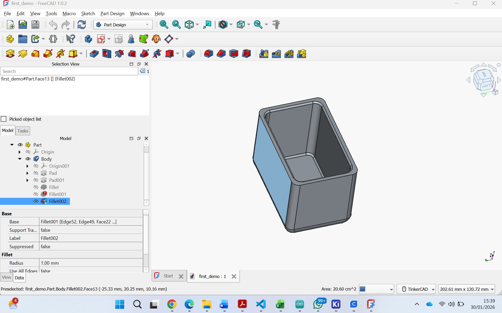
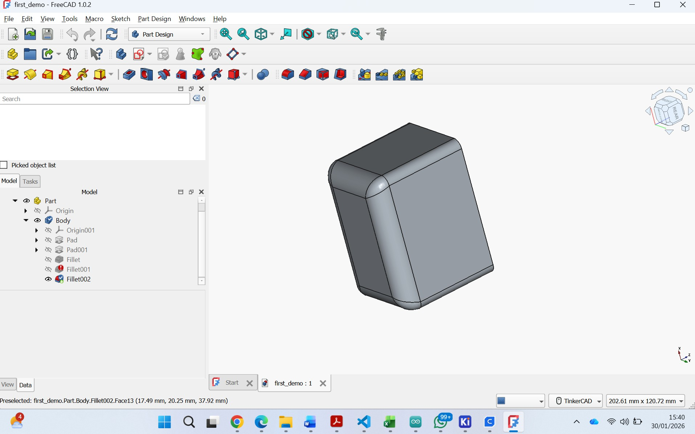
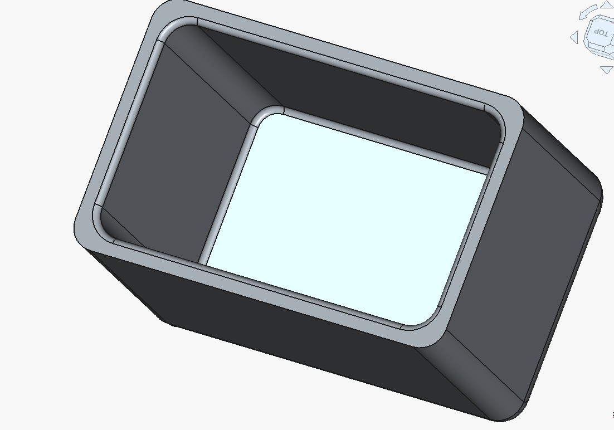

## **The design ready to be printed out**
-------------------------------------
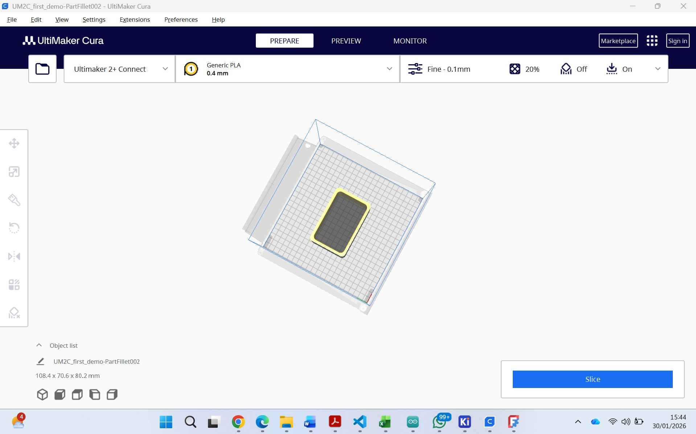
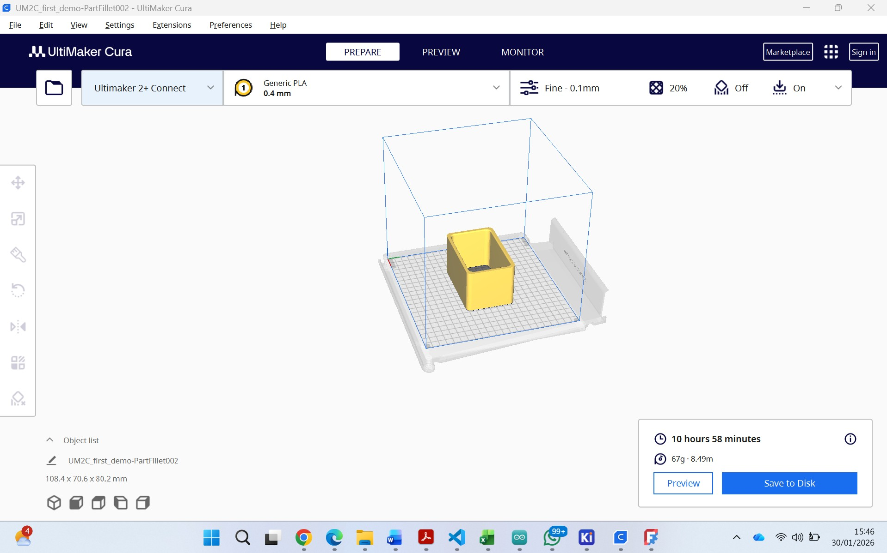

## **The Output of the designed box**
------------------------------------
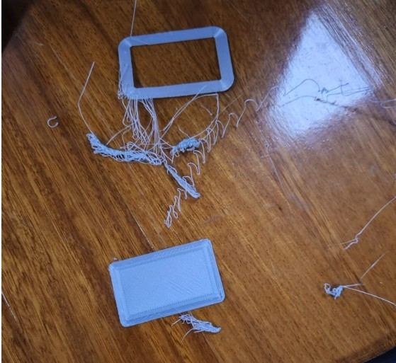
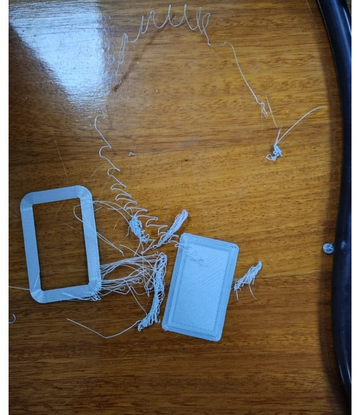
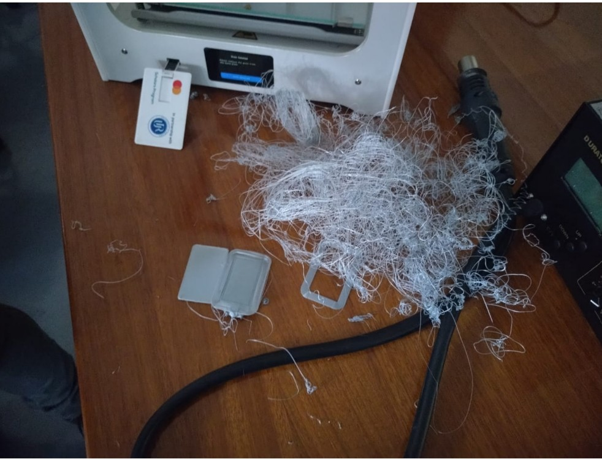
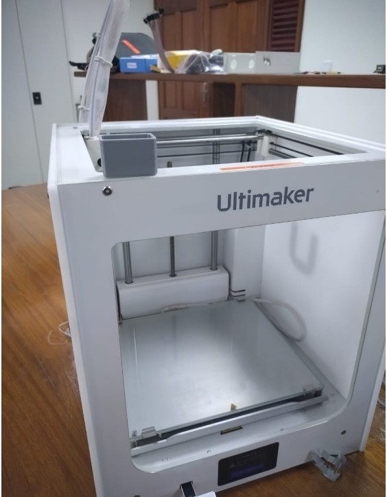
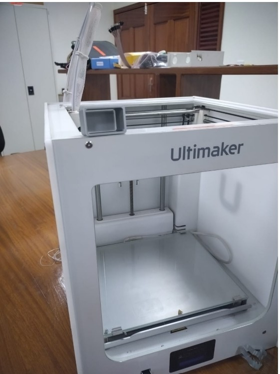
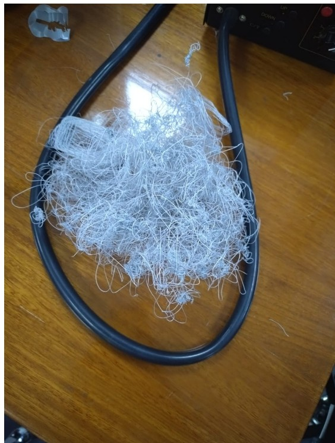
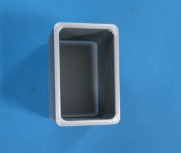
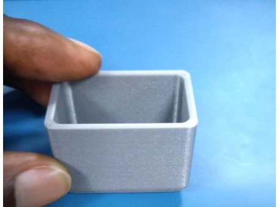