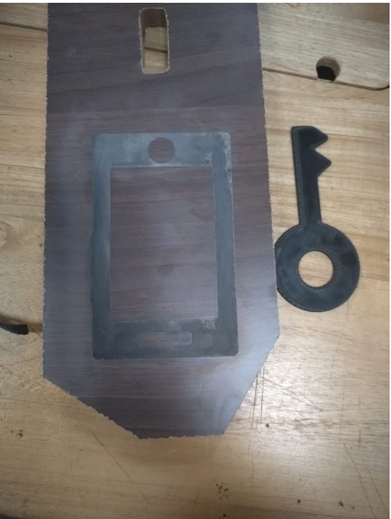
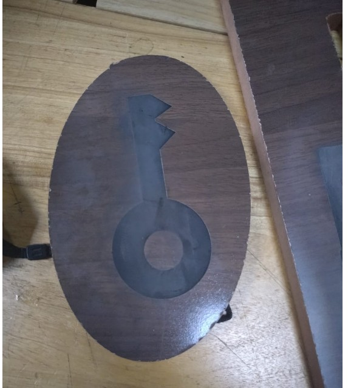
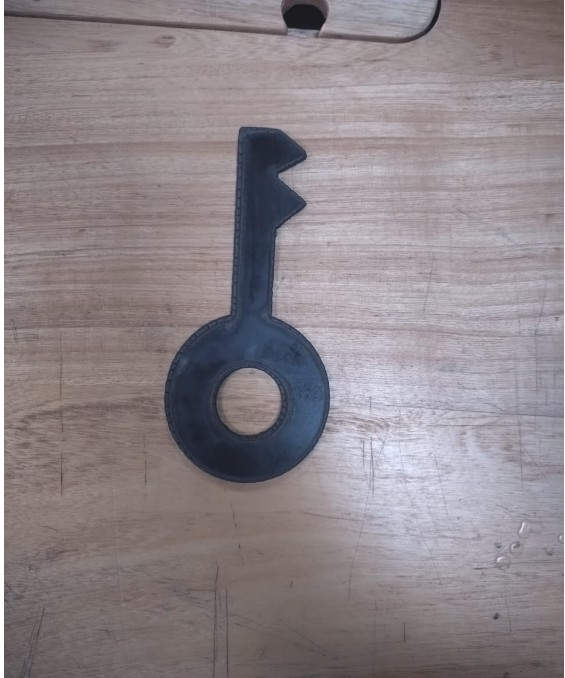

# **7. Activity of Day 7**

# Day 7 – Digital Fabrication III: CNC Router Milling & Cutting

---

## CNC Router Systems and Components

A CNC router is a computer-controlled machine used to cut, carve, and mill sheet materials.  
Key components include:
- Machine frame and bed

- Spindle or router motor

- Linear motion system (X, Y, Z axes)

- Stepper or servo motors

- Controller and control software

These components work together to achieve precise and repeatable cutting operations.

---

## Cutting Tools and Material Compatibility

Different cutting tools are selected based on material type:
- **End mills** for wood, plastics, and soft metals

- **Single-flute bits** for plastics

- **Compression bits** for plywood and laminated materials

Correct tool selection improves cut quality, tool life, and safety.

---

## CAM Workflows and Toolpath Strategies

CAM (Computer-Aided Manufacturing) converts design files into machine instructions.

Typical workflow:
- Import design file

- Select cutting tools

- Define cutting parameters

- Generate toolpaths (profile, pocket, contour)

- Export G-code

Efficient toolpath strategies reduce machining time and material waste.

---

## Sheet Nesting and Material Optimization

Sheet nesting arranges parts efficiently on a material sheet to:
- Minimize material waste

- Reduce machining time

- Improve cost efficiency

Good nesting improves sustainability and production efficiency.

---

## Design for CNC Router Fabrication

Designs must consider:
- Tool diameter limitations

- Internal corner radii

- Material thickness

- Hold-down methods

Designing with these factors in mind ensures accurate and successful fabrication.

---

## Tolerances, Joinery, and Press-Fit Design

- **Tolerances** account for tool diameter and material variation

- **Joinery** includes slots, tabs, and finger joints

- **Press-fit designs** rely on precise tolerances for tight assembly without fasteners

Proper tolerance design ensures strong and accurate assemblies.

---

## Assembly and Structural Evaluation

After machining:

- Parts are assembled and aligned

- Joints are tested for strength

- Structural stability is evaluated

This step ensures the fabricated object meets functional and safety requirements.

---

**Sample design in Laser cutting machine**

**1. The sample of Milling**

**2. The sample of Cutting using laser cutter**

