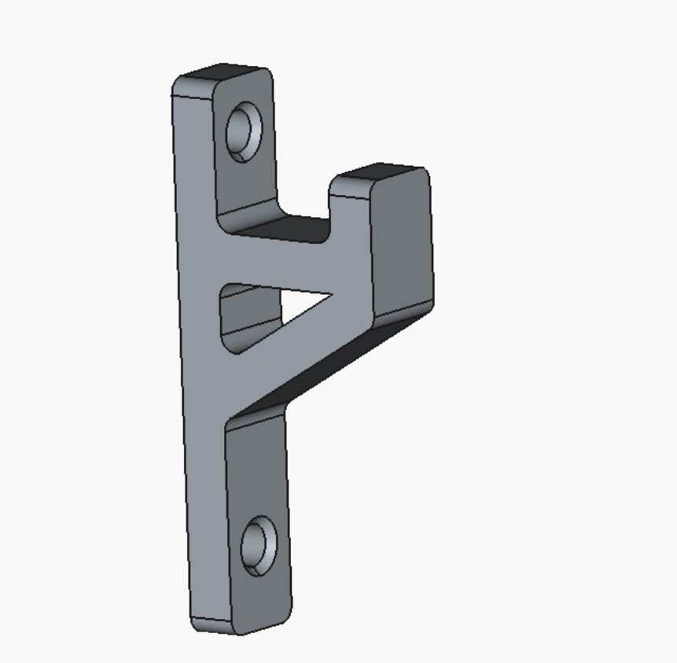
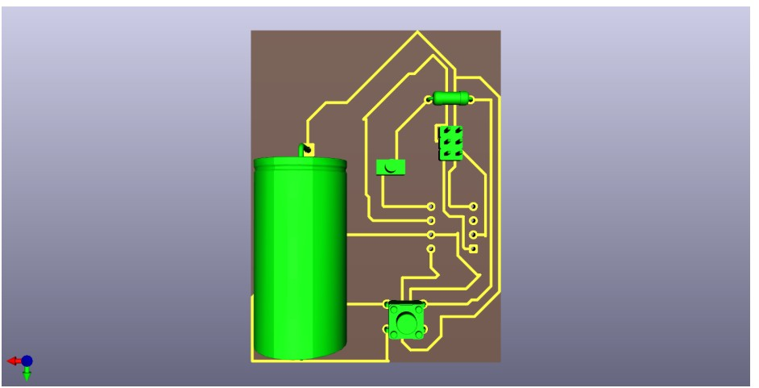
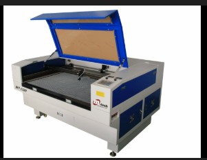
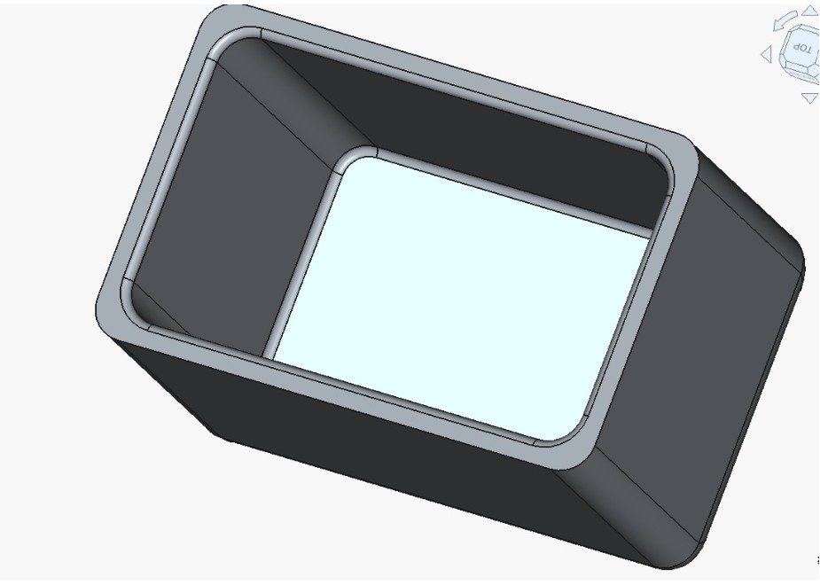
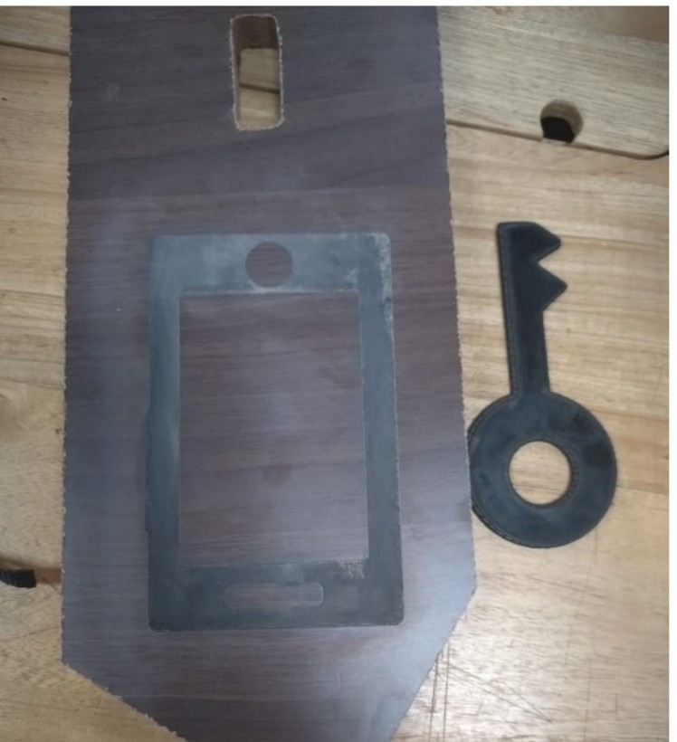
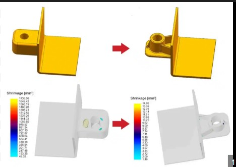

# Assignments

_Welcome, My name HITAYEZU Emile(https://class.textile-academy.org/2020/loes.bogers/) from UR-ACEIoT_

||||
|---|---|---|
|[{ width=175 }  Day 1 Activity](./day_1.md)|[{ width=175 }  Day 2 Activity](./day_2.md)|[{ width=175 }  Day 3 Activity](./day_3.md)|
|[{ width=175 }  Day 4 Activity](./day_4.md)|[{ width=175 }  Day 5 Activity](./day_5.md)|[{ width=175 }  Day 6 Activity](./day_6.md)|
|[{ width=175 }  Day 7 Activity](./day_7.md)|[{ width=175 }  Day 8 Activity](./day_8.md)|[{ width=175 }  Day 9 Activiy](./day_9.md)|

