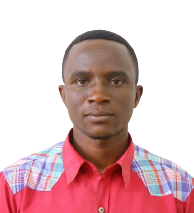
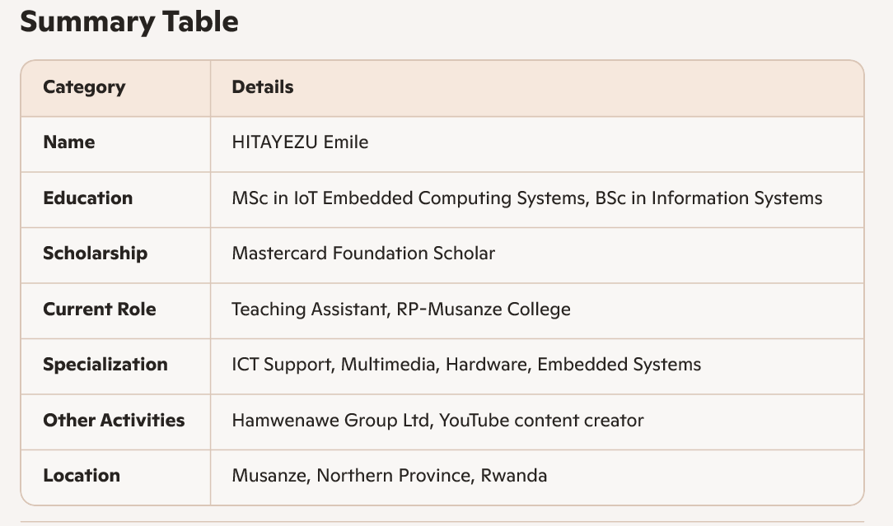

# HITAYEZU Emile's Documentation

## Overview

This documentation was prepared by **HITAYEZU Emile** and covers a series of learning activities and practical work discussed in the previous sessions.  
The content focuses on **digital fabrication, electronics design, and manufacturing methods**, documented using **MkDocs** for clear, structured reporting.

---

## Scope of the Documentation

This documentation includes the following topics:

### 1. Electronics Design and Production
- Single-sided PCB design using **KiCad**
- ATtiny45 microcontroller system
- LED control with push button
- ISP programming interface
- Design for Manufacturing (DFM) for PCB milling

### 2. Day 4 – Materials & Fabrication Methods
- Material properties and selection strategies
- Wood, plastics, metals, and composites
- Subtractive vs additive fabrication
- Material behavior during fabrication
- Sustainability, cost, and lifecycle considerations

### 3. Day 5 – Digital Fabrication I: CNC & Laser Cutting
- CNC machining principles
- Laser cutting workflows and constraints
- Toolpaths, kerf, feeds, and speeds
- 2D and 2.5D fabrication strategies
- File preparation and assembly methods

### 4. Day 6 – Digital Fabrication II: Additive Manufacturing
- 3D printing technologies and workflows
- Print resolution, orientation, and supports
- Design constraints for additive manufacturing
- Material selection for 3D printing
- Post-processing and surface finishing
- Functional vs aesthetic printed parts

### 5. Day 7 – Digital Fabrication III: CNC Router Milling & Cutting
- CNC router systems and components
- Cutting tools and material compatibility
- CAM workflows and toolpath strategies
- Sheet nesting and material optimization
- Design for CNC router fabrication
- Tolerances, joinery, and press-fit design
- Assembly and structural evaluation

---

## Purpose of This Documentation

The purpose of this documentation is to:
- Demonstrate understanding of **digital fabrication concepts**
- Record **practical design and fabrication workflows**
- Provide **clear academic and technical reporting**
- Support learning in **fabrication laboratories and embedded systems**

---

## Author

**Name:** HITAYEZU Emile  
**Field:** IoT & Embedded Computing Systems  
**Institution:** University of Rwanda  
**Documentation Tool:** MkDocs  

---

## Conclusion

This documentation reflects the knowledge and skills developed through hands-on design, fabrication, and analysis. It serves as both a **learning record** and a **professional technical report**.

---

## About me

--------------------------------------------------------------
Mr. HITAYEZU Emile is a Rwandan ICT professional and scholar, currently pursuing an MSc in IoT Embedded Computing Systems at the University of Rwanda. He is also a Mastercard Foundation Scholar and serves as a Teaching Assistant in IT Support, Multimedia, and Hardware at RP-Musanze College.

Academic Background
- MSc in IoT Embedded Computing Systems – University of Rwanda, CST/ACEIoT
- BSc in Information Systems – University of Rwanda
- Postgraduate Mastercard Foundation Scholar – Recognized for academic excellence and leadership potential

Professional Experience
- Teaching Assistant (RP-Musanze College)
- Focus areas: IT Support, Multimedia, and Hardware
- Role: Facilitating practical learning and supporting students in ICT-related modules
- Active since March 2023
- ICT Career Focus
- Specializes in Professional ICT Support
- Experienced in multimedia systems and hardware facilitation

Other Engagements
- Hamwenawe Group Ltd – Associated with announcements and administrative communications in Rwanda
- YouTube Channel – Shares content under the name Emile HITAYEZU, with several videos published

Key Highlights
- Location: Musanze, Northern Province, Rwanda
- Professional Interests: Embedded systems, IoT, ICT support, multimedia, and hardware integration
- Community Engagement: Active in academic teaching, ICT facilitation, and digital content creation

## My background

I was born in a nice city called in GOMA, DRC

<!-- This below clears both sides under "aligned" images - see two images above.
Can also be used just as "clear: right;" rather than "clear: both;", if you are using an image on the right, for example.
-->

  

